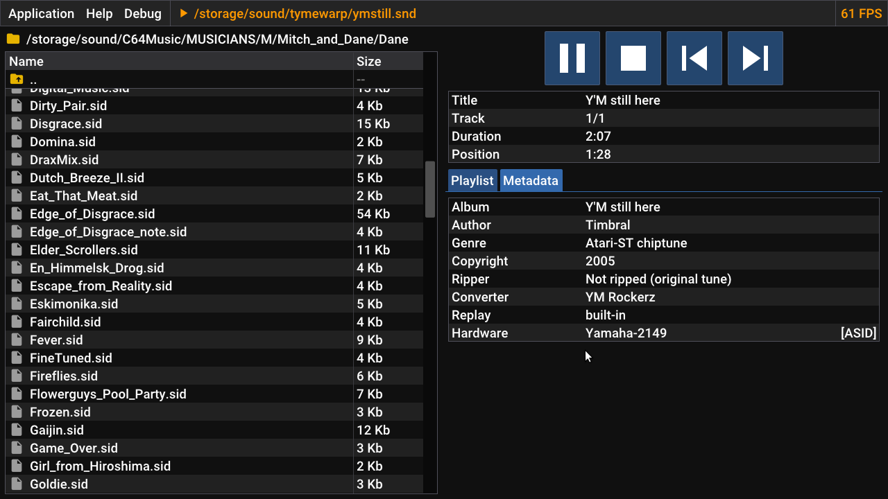
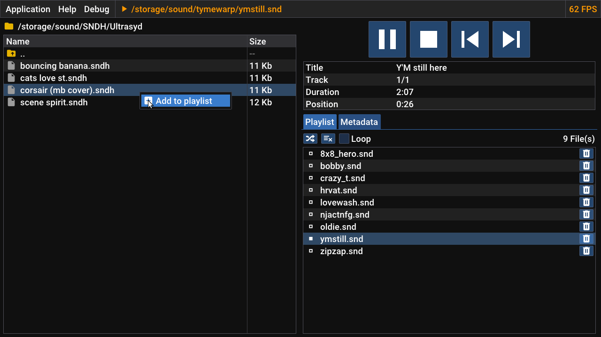
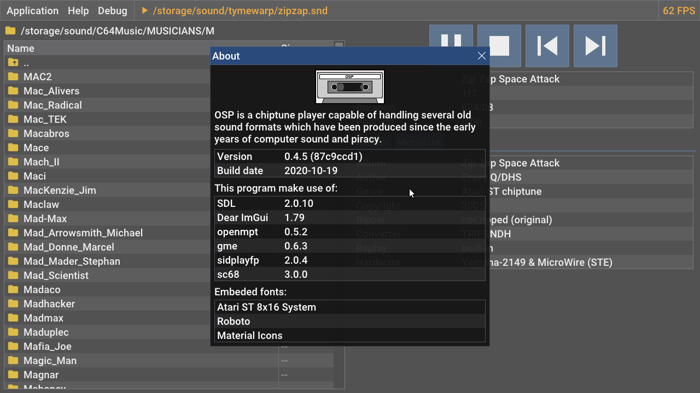

# OSP - Old School Player
Yet another chiptune player.

### Supported formats:

snd, sndh, sc68, sid, psid, rsid, mus, ay, gbs, gym, hes, kss, nsf, nsfe, sap, spc, vgm, vgz, mptm, mod, s3m, xm, it, 669, amf, ams, c67, dbm, digi, dmf, dsm, dtm, far, imf, ice, j2b, m15, mdl, med, mms, mt2, mtm, nst, okt, plm, psm, pt36, ptm, sfx, sfx2, st26, stk, stm, stp, ult, wow, gdm, mo3, oxm, umx, xpk, ppm, mmcmp

### Controls:

- With mouse emulation:
    - Left joystick: move cursor
    - Right joystick: scroll up/down in area allowed to scroll
    - A: Left click
    - X: Right click (display some popup menus according on the hovered item)
    - L shoulder: Speed down mouse and scroll (keep button down)
    - R shoulder: Speed up mouse and scroll (keep button down)

- Touch controls can be enabled/disabled (it work as a "mouse right click", no more)

- Nintendo switch usb mouse support (please disable manually mouse emulation in this case)

- Obviously, don't try to disable mouse emulation AND touch controls if you do not have an USB mouse compatible with your Switch hehe.

### Build

To be able to compile the project you need the following libraries installed in your system:

- libsdl2, libsdl2-image, libjansson, libfmt, libconfig++ wich can be found is usually your package manager.
- [libgme](https://github.com/ShiftMediaProject/game-music-emu), [libsidplayfp](https://sourceforge.net/projects/sidplay-residfp/), [libsc68](https://sourceforge.net/projects/sc68/) and [libopenmpt](https://lib.openmpt.org/libopenmpt/) wich can be optained by following the links above in case they are not available on your system.
- [Glad loader](https://glad.dav1d.de/) installed with 3.3 Core capabilities (your video card must support OpenGL 3.3 Core)

Currently this code can be build for Nintendo Switch and Linux but you may need to tweak the Makefile.sdl to fit your Linux needs.
I essentially target the switch and the other build help me for debug purpose.

This source code is bundled with a version of [ImGui](https://github.com/ocornut/imgui) (1.79 tables branch) and [ECS](https://github.com/redxdev/ECS) and some fonts ([Atari ST 8x16](https://www.dafont.com/fr/atari-st-8x16-system-font.font), [Material Design Icons](https://materialdesignicons.com/), and [Roboto](https://fonts.google.com/specimen/Roboto))

### Todos:
- FileSystem
    - Use more than one thread. Maybe one for files and one for directories.
- Playlist
    - Add an entry to the explorer popup menu to add a folder in the playlist

### Some ideas:
- Implement the ability to browse modland ftp
- Create some custom controls using the ImGui framework
- Vu meter around the player controls (left and right)
- When the worspace is not visible, add options to show something (minigames, song information, shaders...)
- Battery save mode (black screen, stop refreshing or do it at low fps ?)
- Add a better touch support

### Screenshots

